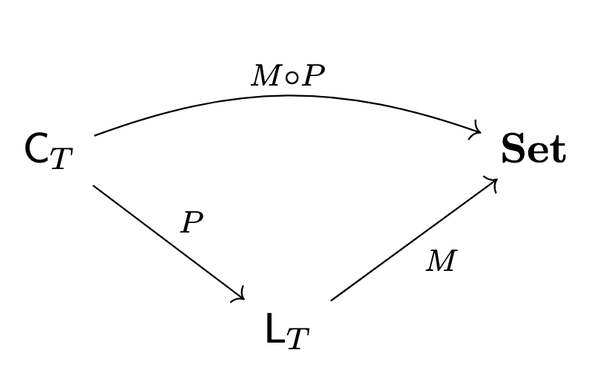

# A Racket Implementation of the Structure-Logic-Computation (SLC) Theorem

[](https://racket-lang.org)
[](LICENSE)

> **Research prototype** implementing the *Structure‑Logic‑Computation theorem*, an extension of the Curry‑Howard‑Lambek correspondence.  A Lawvere theory **T** gives rise to two canonical categories—**LT** (logic) and **CT** (computation)—that are sound and complete with respect to the models of **T**.

---

## Table of Contents

1. [Quick Start](#quick-start)
2. [Paper & Theory](#paper--theory)
3. [Architecture](#architecture)
4. [Interactive Environment](#interactive-environment)
5. [Examples](#examples)
6. [Documentation](#documentation)
7. [Testing](#testing)
8. [Future Roadmap](#future-roadmap)
9. [Status](#status)
10. [Citing this Work](#citing-this-work)
11. [License](#license)

---

## Quick Start

```bash
# 1. Prerequisites — Racket ≥ 8.0
#    https://download.racket-lang.org/releases/

# 2. Clone the repository
$ git clone https://github.com/ppcavalcante/slc.git
$ cd slc

# 3. (Optional): register & pre-compile
$ raco pkg install --auto  

# 4. Run the test‑suite
$ racket tests/main-tests.rkt

# 5. Launch the interactive REPL
$ racket slc/interactive.rkt
```

---

## Paper & Theory

This prototype accompanies the paper [**“Extending Curry‑Howard‑Lambek: The Structure‑Logic‑Computation (SLC) Theorem”**](https://doi.org/10.5281/zenodo.15724275).

> **SLC Theorem**  Given an algebraic structure (operations + equations), one obtains—canonically and completely—both a logic of equational consequences (**LT**) and a computation model of term rewrites (**CT**).

### Commutative Diagram

<div align="center">
  
</div>

* **CT** — Category of raw terms and substitutions (computation).
* **LT** — Category of terms modulo equations (logic).
* **Set** — Semantic models.
* **P : CT → LT** — Canonical projection.
* **M : LT → Set** — A chosen model.
* **M ∘ P : CT → Set** — Direct interpretation of raw terms.

---

## Architecture

### Core Modules

| File                    | Purpose                                  |
| ----------------------- | ---------------------------------------- |
| `slc/core.rkt`          | Library re‑exports                       |
| `slc/theories.rkt`      | Lawvere theory DSL & registry            |
| `slc/terms.rkt`         | Term representation & basic operations   |
| `slc/lt.rkt`            | **LT** implementation (equational logic) |
| `slc/ct.rkt`            | **CT** implementation (rewrite search)   |
| `slc/slc-simulator.rkt` | Bridging **LT ⇄ CT** algorithms          |
| `slc/interactive.rkt`   | Terminal REPL                            |

### Support & Utility Modules

| File                       | Purpose                                    |
| -------------------------- | ------------------------------------------ |
| `slc/parser.rkt`           | Infix ↔ prefix parser & pretty‑printer     |
| `slc/proofs.rkt`           | Proof object structures & helpers          |
| `slc/errors.rkt`           | Structured error hierarchy & formatter     |
| `slc/theory-analysis.rkt`  | Property, confluence & complexity analysis |
| `slc/performance-demo.rkt` | Benchmark & optimisation showcase          |

### Meta / Build

| File/Dir       | Purpose                                                       |
| -------------- | ------------------------------------------------------------- |
| `scribblings/` | Scribble manuals (`installation.scrbl`, `reference.scrbl`, …) |
| `info.rkt`     | Package metadata (deps, docs, version)                        |
| `Makefile`     | Common tasks (`make test`, `make docs`, `make repl`)          |


### Capabilities

* **Equational prover** on **LT** (automatic, BFS, A\*, confluent normalization).
* **Rewrite simulator** on **CT** (bidirectional rules, custom depth/heuristics).
* **Bridging function `prover+simulator`** — proves equalities via rewrite paths.
* Easily extensible: plug‑in search strategies, new theories, or custom heuristics.

### Example Theories

* `slc/examples/monoid.rkt` — monoid laws (associativity + identity)
* `slc/examples/group.rkt` — monoid laws + inverses
* `slc/examples/ring.rkt` — ring laws (addition + multiplication)

---

## Interactive Environment

```text
Theory Management
  use-theory <name>                   Load a predefined theory
  define-theory <name> <axiom …>      Define a custom theory

Proof & Computation
  prove <LHS> = <RHS>                Prove equality (LT)
  simulate <TERM> [--depth=N]         Explore rewrite paths (CT)
  normalize <TERM>                    Reduce to normal form

Utilities
  help   exit   clear-cache
```

---

## Examples

### Monoid

```racket
;; slc> use-theory Monoid
;; slc> prove (x * y) * z = x * (y * z)
✓ Proved: ((x * y) * z) = (x * (y * z))  (method: auto)
```

### Group

```racket
;; slc> use-theory Group
;; slc> prove x * ginv(x) = e
✓ Proved: (x * (ginv x)) = e  (method: confluent)
```

### Custom Theory

```racket
;; slc> define-theory Simple "x + y = y + x" "x + 0 = x"
;; slc> prove 0 + x = x + 0
✓ Proved: (0 + x) = (x + 0)  (method: auto)
```

---

## Documentation

Build full HTML docs with Racket *Scribble*:

```bash
make docs
open docs/html/slc.html
```

---

## Testing

```bash
# Run all tests
a) racket tests/main-tests.rkt

# Run specific suites
b) racket tests/test-terms.rkt
c) racket tests/test-ct.rkt
d) racket tests/test-lt.rkt
```

---

## Future Roadmap

Two major enhancements are planned that would significantly extend the system's capabilities:

### 1. Complete LT ↔ CT Bridge
Currently: **LT → CT** (proofs convert to rewrite paths)  
**Planned**: **CT → LT** (rewrite paths back to formal proofs)

This would demonstrate the true bidirectional equivalence of the SLC theorem by automatically reconstructing formal proof objects from computational rewrite paths.

### 2. Knuth-Bendix Completion
**Planned**: **Automatic theory completion** for confluence

Transform non-confluent theories into confluent ones, enabling:
- O(n) equality checking via normalization
- Unique canonical forms for all terms  
- Massive performance improvements for large theories

---

## Status

> **Alpha research prototype v0.1.0‑alpha**

---

## Citing this Work

A `CITATION.cff` file is included; GitHub’s **“Cite this repository”** button provides ready‑made formats.  For BibTeX:

```bibtex
@software{Cavalcante2025slc-impl,
  author    = {Cavalcante, Pedro},
  title     = {{A Racket Implementation of the Structure-Logic-Computation (SLC) Theorem}},
  year      = {2025},
  version   = {0.1.0-alpha},
  publisher = {Zenodo},
  doi       = {10.5281/zenodo.15724304},
  url       = {https://doi.org/10.5281/zenodo.15724304}
}
```

---

## License

MIT — see the [LICENSE](LICENSE) file.
